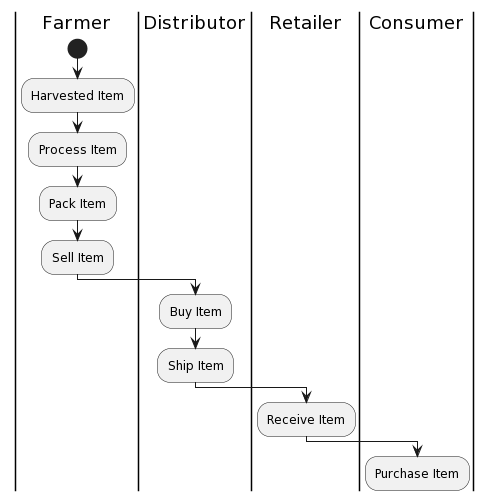
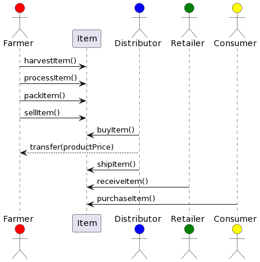
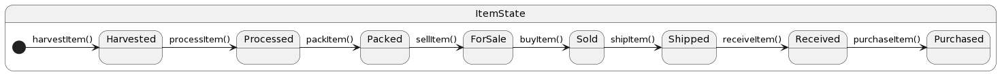
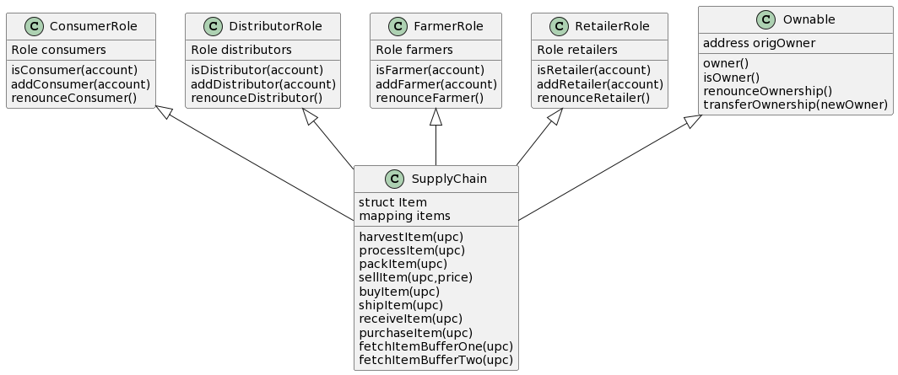
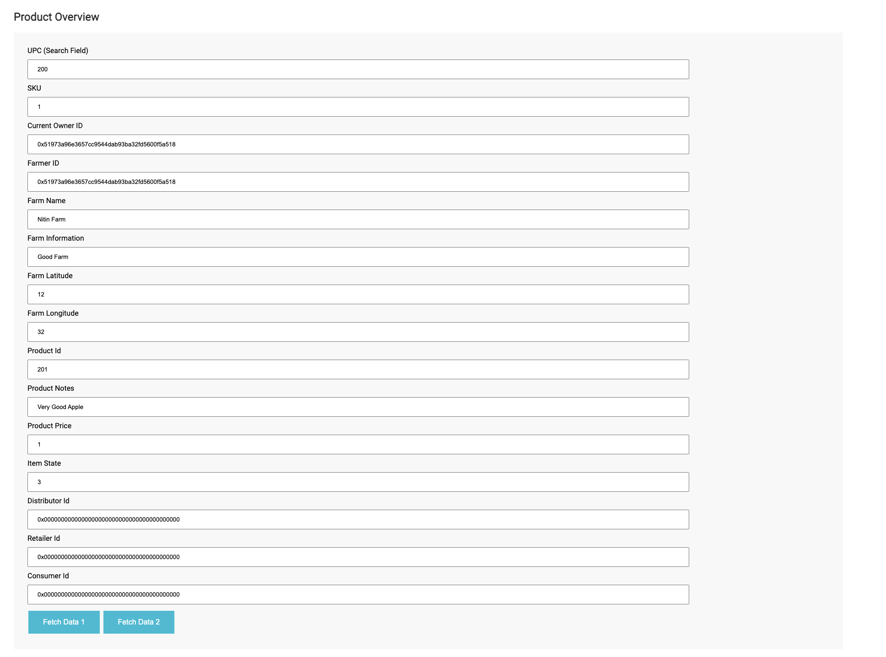
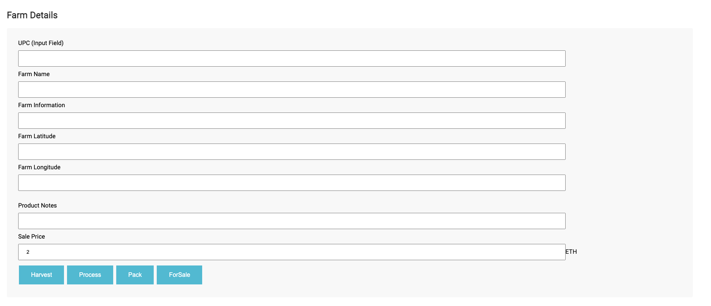
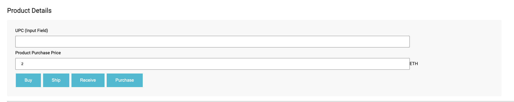

# Supply chain & data auditing

## Contract Address

Rinkeby Contract - https://rinkeby.etherscan.io/address/0x59884F6Db35a33F60EC0c1DC207a0C535F48eb68

Transaction ID - https://rinkeby.etherscan.io/tx/0xaffecf2e75cc6acb123c5f1070225726018bf678939fcb0a4e19d1f127af3ded

## Libraries Used

1. truffle-hdwallet-provider - Used in truffle-config.js to migrate contract on rinkeby network.

2. web3 - It allows us to interact with a local or remote ethereum node using HTTP, IPC or WebSocket.

## IPFS

IPFS is not used in this Project

## Program version numbers

1. Node Version - v16.15.1
2. Truffle Version - v5.5.22
3. web3 Version - v1.7.4
4. Solidity Version - 0.5.16

## UML Diagrams

1. Activity Diagram

2. Sequence Diagram

3. State Diagram 

4. Data Diagram

## UI Screens

1. Validate the authenticity of the product.

Enter UPC to fetch product details.

2. Create product item and submit for sale.

Enter UPC to create product and move to other states.

3. Create product item and submit for sale.

Enter UPC to buy product and move to other states.

